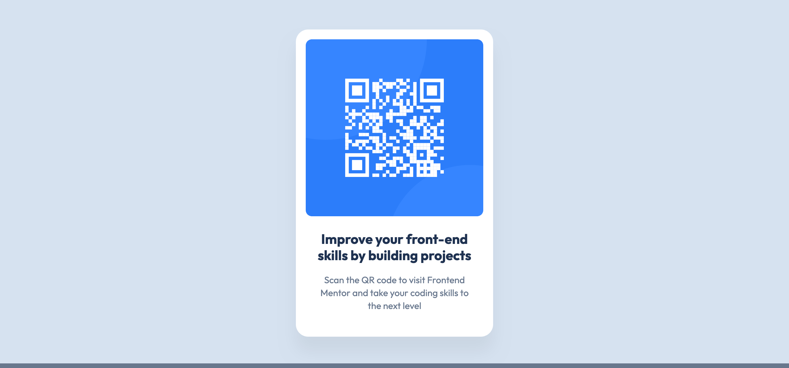

# Frontend Mentor - QR code component solution

This is a solution to the [QR code component challenge on Frontend Mentor](https://www.frontendmentor.io/challenges/qr-code-component-iux_sIO_H). Frontend Mentor challenges help you improve your coding skills by building realistic projects. 

## Table of contents

- [Overview](#overview)
  - [Screenshot](#screenshot)
  - [Links](#links)
- [My process](#my-process)
  - [Built with](#built-with)
  - [What I learned](#what-i-learned)
  - [Continued development](#continued-development)
- [Author](#author)
- [Acknowledgments](#acknowledgments)

## Overview

### Screenshot

### Links

- [Github](https://github.com/BastienWinant/qr-code-component)
- [Live site](https://dulcet-capybara-185dd3.netlify.app/)

## My process

### Built with

- Semantic HTML5 markup
- CSS custom properties
- Flexbox
- Mobile-first workflow
- [React](https://reactjs.org/) - JS library

### What I learned

I decided to use this project to get some practice and further improve my grasp of compound components in React. My focus was on reusability and creating a template for easily rendering any number of QR code images with consistent stylized formatting.

The `<QRCodeCard />` component takes a path to an image (presumably a QR code) as a prop, as well as optional nested content to accompany the image. It essentially acts as a wrapper around the semantic `figure`/`figcaption` structure that adds a formatting layer.

As a way of providing context for the QR code, the component is built to accept two types of customized sub-components:
1. `<QRCodeCard.Title />`
- renders the nested text in an `<h2>` element
- represents a short message such as an call to action
2. `<QRCodeCard.Description />`
- renders the nested text in a `
` element
- placeholder for a brief explanation of what to expect when scanning the QR code

In this project, I had a chance to work through the process of breaking down a design into separate subparts and creating corresponding compound components in React.

### Continued development

Ultimately, this implementation is overly complex given the original scope of the project. My intention is to continue using projects with relatively simple UIs to focus on code modularity and scalability. I am hoping that this additional practice will prove useful when graduating to more complex projects and full-fledged web applications.

I identified the following possible extensions for the project:
- __reusability/modularity:__ allowing for easy control of the appearance of the `<QRCodeCard />` component through additional props
- __functionality:__ adding a button to share the QR code and caption via social media or email

## Author

- Frontend Mentor - [@BastienWinant](https://www.frontendmentor.io/profile/BastienWinant)
- Github - [@BastienWinant](https://www.github.com/BastienWinant)

## Acknowledgments

I started this project after completing the Frontend Developer Career Path on [Scrimba](https://scrimba.com/). The program teaches core web development skills (HTML/CSS/JS with React) through a blend of interactive lessons and projects.